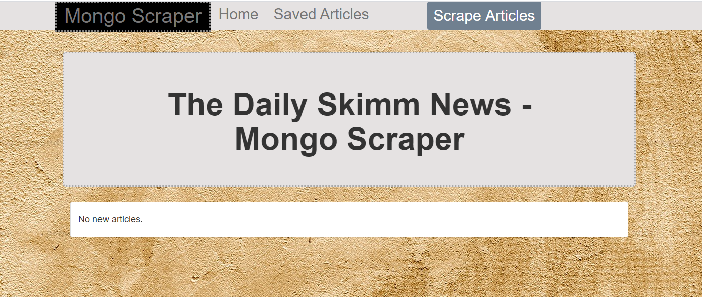
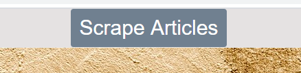
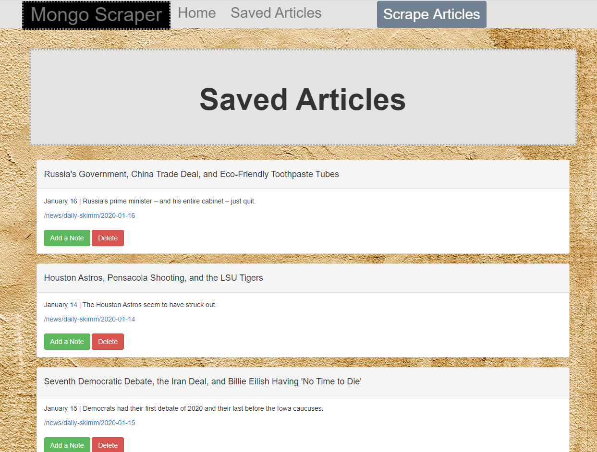
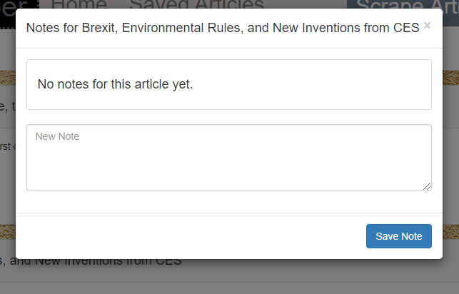

# MongoDB News Scraper:  The Daily Skimm Edition

###### An app that lets users scrape articles from the news website: The Daily Skimm. Then they can save/delete articles and save/delete notes about the articles.

### Where you can scrape

###  Then see your saved articles

### Add a note to an article

### Will need to have Mongo running on your computer, run an npm install, and run node server.js.

### Technologies Used
* Node.js
* MongoDB 
* Mongoose
* Express
* Express-handlebars
* Cheerio
* Axios
* Javascript